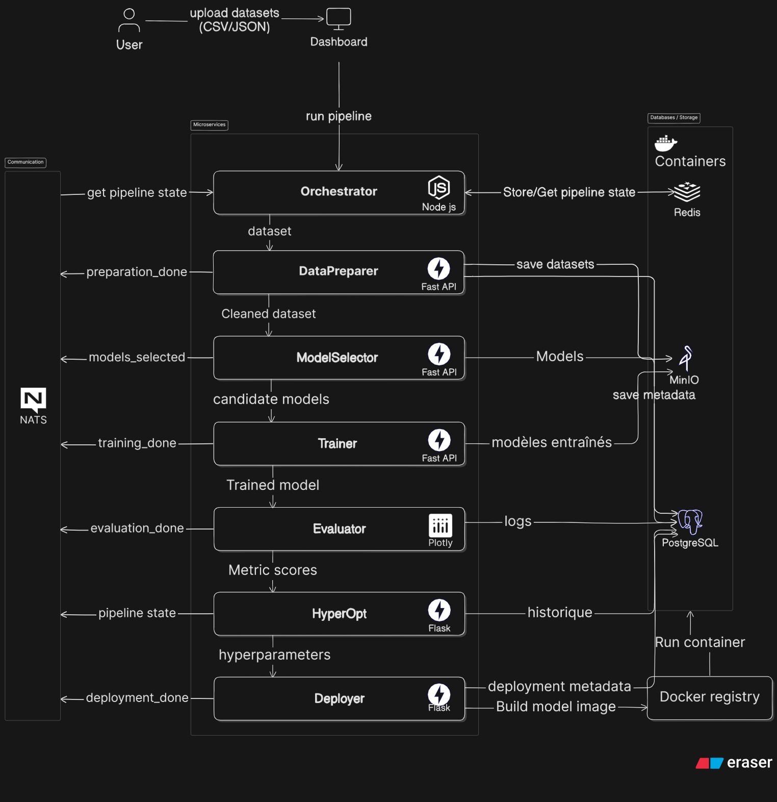

# MicroLearn — Orchestrateur AutoML par microservices  

> **Projet académique** – Plateforme AutoML distribuée par microservices, développée en mode startup par une équipe de 4 personnes.  
> Objectif : automatiser et orchestrer le cycle complet de Machine Learning (préparation → sélection → entraînement → évaluation → déploiement) via API et dashboard web.  

---

Azure devops: https://dev.azure.com/SoulaimaneOuhmida/MicroLearn


---
---
# Architecture


## 1. Orchestrator
- receives a pipeline definition (YAML/JSON),
- executes ML steps in order:
    - DataPreparer → ModelSelector → Trainer → Evaluator → HyperOpt → Deployer
- communicates asynchronously with microservices,
- tracks state and progress,
- exposes an API for execution & monitoring.


---
---
# How to run
## Infrastructure
```
cd infrastracture 
docker-compose up -d
```

## Micro7 - Orchestrator
```
cd services/micro7-orchestrator
npm start
```

## Micro1 - Data_preparer
```
cd services/micro1-data_preparer
venv\Scripts\activate     
uvicorn app.main:app --host 0.0.0.0 --port 8000 --reload
```

## Micro2 - Model_selector
```
cd services/micro2-model_selector
venv\Scripts\activate     
uvicorn app.main:app --host 0.0.0.0 --port 8001 --reload
```

## Micro3 - Trainer
```
cd services/micro3-trainer
venv\Scripts\activate     
uvicorn app.main:app --host 0.0.0.0 --port 8002 --reload
```
